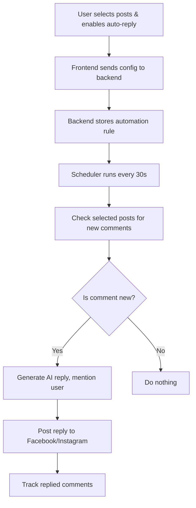

# AI Auto-Reply System: Feature Structure & Architecture

## 📋 Requirements

- Automatically reply to comments on selected Facebook (or Instagram) posts using AI.
- Mention the commenter in the reply (e.g., `@John Thanks for ...`).
- One reply per comment: AI should only reply once to each comment, but if the user replies again, AI should reply again.
- Stop when user stops: If the user stops replying, AI stops as well.
- No template required: AI generates contextual replies by default, but a template can be optionally provided.
- Frontend UI: Allow users to select posts for auto-reply and enable/disable the feature.
- Backend: Store automation rules, monitor comments, and post replies using the platform API and an AI service.

---

## 🏗️ Architecture Overview

---

## 🗂️ Key Components

### 1. **Frontend**
- UI for selecting posts and enabling/disabling auto-reply
- Sends configuration to backend
- Shows status and feedback to user

### 2. **Backend API**
- Endpoints to receive auto-reply configuration
- Stores automation rules in the database
- Exposes endpoints to fetch posts for selection

### 3. **Automation Rule Model**
- Stores which posts are monitored
- Stores user preferences (template, enabled/disabled, etc.)

### 4. **Scheduler Service**
- Runs periodically (e.g., every 30 seconds)
- Checks for new comments on selected posts
- Triggers auto-reply logic

### 5. **Auto-Reply Service**
- Groups comments by conversation thread
- Replies only once per comment
- Continues conversation if user replies again
- Stops when user stops
- Uses AI to generate contextual replies
- Mentions the commenter in the reply
- Tracks which comments have been replied to

### 6. **AI Service**
- Generates contextual, friendly replies
- Optionally uses a template as a guide

---

## 📝 How to Adapt for Instagram

- Replace Facebook API endpoints with Instagram equivalents.
- Use Instagram post IDs and comment IDs.
- Update the frontend to allow selection of Instagram posts.
- The conversation logic and AI reply detection remain the same.

---

## 🧑‍🏫 Summary

- **AI Auto-Reply**: Monitors selected posts, replies once per comment, continues if user replies, stops when user stops.
- **Extensible**: The same logic can be used for Instagram by swapping out the platform-specific API calls.
- **Clean separation**: Frontend for config, backend for logic, scheduler for periodic checks.

---

**Use this structure as a blueprint to implement the same feature for Instagram!** 